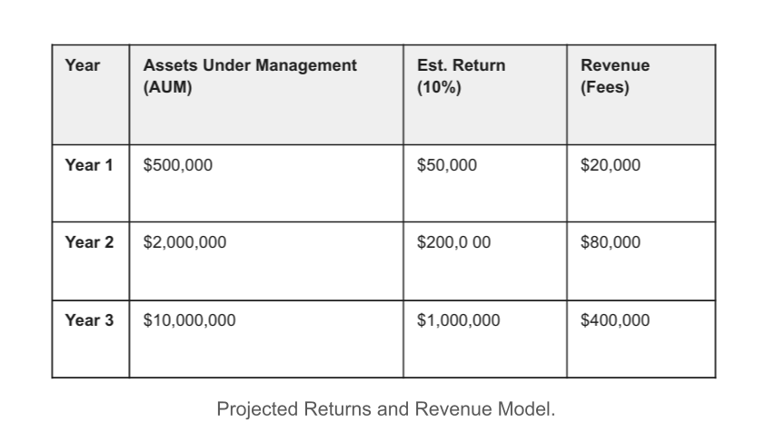
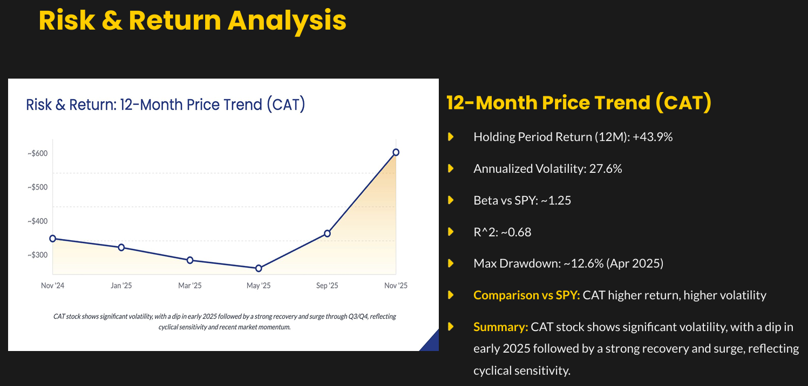
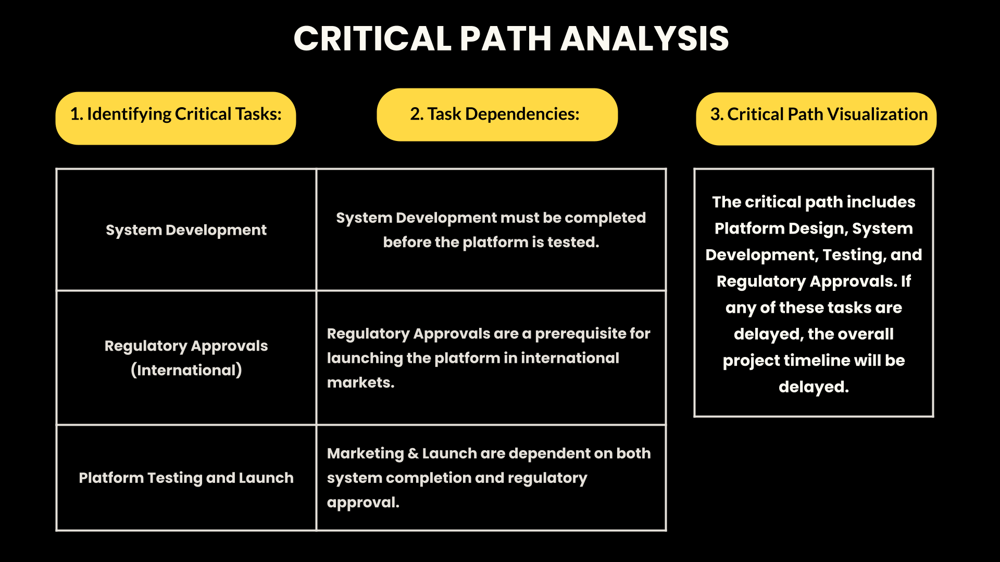
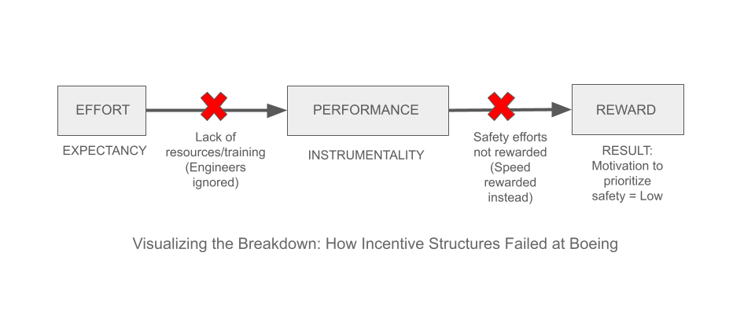

  # Business Analyst | Business Strategy | Data Analyst

#### Technical Skills: SQL, Excel, PowerBI, Business Analysis

## Education
- M.S, Management, Business Analytics concentration | New Jersey Institute of Technology, Newark NJ (_December 2026_)								       		
- B.E., Biotechnology	| Netaji Subhas Institute of Technology, New Delhi (_May 2019_)	 			        		

## Work Experience
**Operations Associate @ Aasaanjobs.com (_Jul 2019 - Aug 2019_)**
- Supervised document verification team and improved collection rate by incorporating structured speech templates.
- Guided grievance resolution team and improved weekly resolution rate utilizing strategic task delegation.
- Enhanced task completion efficiency by restructuring team seating and optimizing email labeling system within Gmail.
- Managed client databases using Google Sheets and Excel, leveraged pivot tables and lookup functions for efficient data retrieval.

**Research Lab Intern @ International Center for Genetic Engineering and Biotechnology (_Jun 2018 - Jul 2018_)**
- Collaborated with senior fellows to execute complex experimental workflows for malaria vaccine research (OPA3 protein).
- Maintained strict operational standards and data accuracy during testing, ensuring zero contamination or documentation errors.

## Projects

### Lending Club: Algorithmic Investment Strategy Fall 2025 [LINK]()

Designed a quantitative business plan for a $5M Peer-to-Peer (P2P) lending fund, analyzing a dataset of over 1 million loan records to identify high-yield borrower segments. Evaluated the feasibility of Machine Learning classifiers (SVM, Neural Networks) for default prediction, conducting a gap analysis between the model’s performance (AUROC 0.69) and industry baselines to assess deployment viability.

Constructed a financial revenue model projecting a Net Annualized Return (NAR) of 9-11%, significantly outperforming passive market indices. The strategy focused on bridging the gap between data science and financial constraints, prioritizing feature engineering and risk management over raw algorithmic complexity to ensure fund solvency.

---

### Cloud Data Management: Sports Performance Analytics Spring 2025 [LINK]()
Managed large-scale MLB dataset hosted on AWS to optimize talent recruitment strategies.
Engineered a Master Player View using Complex Joins and Window Functions (PARTITION BY) to smooth out salary volatility and identify consistent high-performers over a 5-year period.
Tools: SQL (Advanced Querying), AWS RDS, Data Normalization

---

### M&A Strategic Analysis: Microsoft x Activision Spring 2025 [LINK]()
Evaluated a $68B acquisition target using quantitative decision models. Analyzed EBITDA margins and user growth across 4 potential targets to justify the 45% acquisition premium.

---

### Caterpillar Inc. (CAT): Financial Valuation & Strategy Fall 2025 [LINK]()

Collaborated on a comprehensive investment analysis of Caterpillar Inc., combining fundamental financial evaluation with machine learning-based price forecasting. Conducted deep-dive ratio analysis of Q3 2025 financial statements to assess operational health and validate the team's valuation models against market reality.

Leveraged financial data to identify undervaluation trends and align fundamental metrics with technical indicators. Contributed to a data-backed "Buy" recommendation that bridged traditional financial theory with predictive analytics.

---

### Digital Arena: Virtual $10M Global Project Planning and Execution Fall 2024 [LINK]()

Developed the operational execution planning for a $10M global streaming startup, translating a Critical Path schedule into actionable business steps. The strategy focused on a Phased Global Launch, prioritizing a North American release to validate technical stability before expanding to international markets in Asia and Latin America.

Defined the resource procurement roadmap—securing cloud infrastructure and legal talent—and structured the development timeline to align with strict regulatory deadlines. Ensured the rollout met international standards (GDPR, COPPA) while allocating a $2M annual budget for post-launch sustainability and logistics.

---

### Boeing Crisis: Organizational Behavior Case Study Fall 2025 [LINK]()

Analyzed the Boeing 737 MAX crisis to diagnose the organizational shift from an engineering-centric culture to one driven by financial metrics. Applied frameworks like Expectancy Theory and Psychological Safety to show how management practices discouraged dissent and severed the link between safety efforts and rewards.

Developed a strategic turnaround plan centered on re-establishing engineering literacy at the executive level. Proposed a new incentive structure that aligns leadership goals with safety and ethics rather than just speed, offering a roadmap to restore operational integrity.

