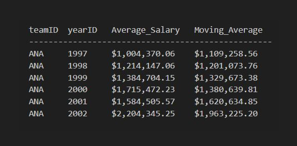
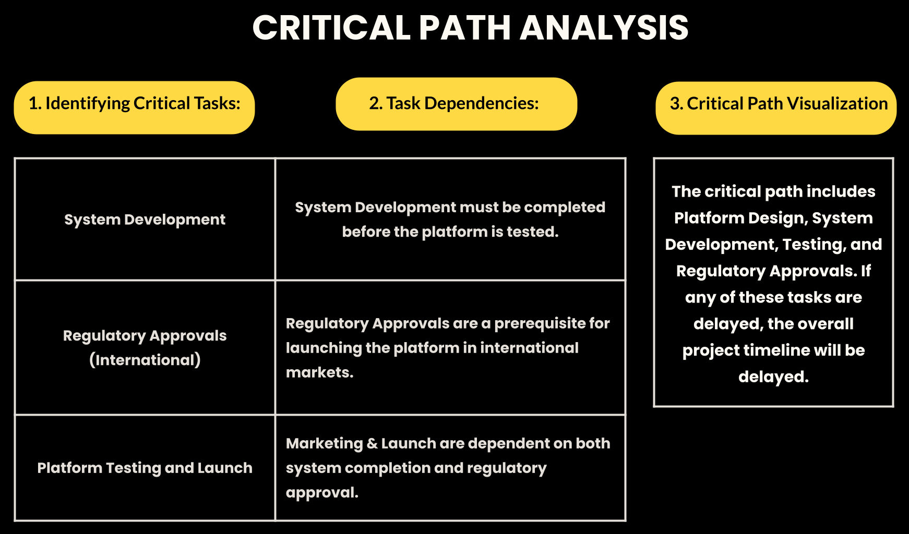

### Cloud Data Management: Sports Performance Analytics Spring 2025 | Database Management using SQL [LINK]() 
Managed large-scale MLB dataset hosted on AWS to optimize talent recruitment strategies.
Engineered a Master Player View using Complex Joins and Window Functions (PARTITION BY) to smooth out salary volatility and identify consistent high-performers over a 5-year period.
Tools: SQL (Advanced Querying), AWS RDS, Data Normalization

---

### M&A Strategic Analysis: Microsoft x Activision Spring 2025 | Business Analytics using Quantitative Modeling [LINK]()
Evaluated a $68B acquisition target using quantitative decision models. Analyzed EBITDA margins and user growth across 4 potential targets to justify the 45% acquisition premium.

---

### Caterpillar Inc. (CAT): Financial Valuation & Strategy Fall 2025 | Corporate Finance Analytics [LINK]()

Collaborated on a comprehensive investment analysis of Caterpillar Inc., combining fundamental financial evaluation with machine learning-based price forecasting. Conducted deep-dive ratio analysis of Q3 2025 financial statements to assess operational health and validate the team's valuation models against market reality.

Leveraged financial data to identify undervaluation trends and align fundamental metrics with technical indicators. Contributed to a data-backed "Buy" recommendation that bridged traditional financial theory with predictive analytics.

  
  

 

---

### Digital Arena: Virtual $10M Global Project Planning and Execution Fall 2024 | Global Project Management [LINK]()

Developed the operational execution planning for a $10M global streaming startup, translating a Critical Path schedule into actionable business steps. The strategy focused on a Phased Global Launch, prioritizing a North American release to validate technical stability before expanding to international markets in Asia and Latin America.

Defined the resource procurement roadmap—securing cloud infrastructure and legal talent—and structured the development timeline to align with strict regulatory deadlines. Ensured the rollout met international standards (GDPR, COPPA) while allocating a $2M annual budget for post-launch sustainability and logistics.

---

### Boeing Crisis: Organizational Behavior Case Study Fall 2025 | Organizational Behavior [LINK]()

Analyzed the Boeing 737 MAX crisis to diagnose the organizational shift from an engineering-centric culture to one driven by financial metrics. Applied frameworks like Expectancy Theory and Psychological Safety to show how management practices discouraged dissent and severed the link between safety efforts and rewards.

Developed a strategic turnaround plan centered on re-establishing engineering literacy at the executive level. Proposed a new incentive structure that aligns leadership goals with safety and ethics rather than just speed, offering a roadmap to restore operational integrity.

